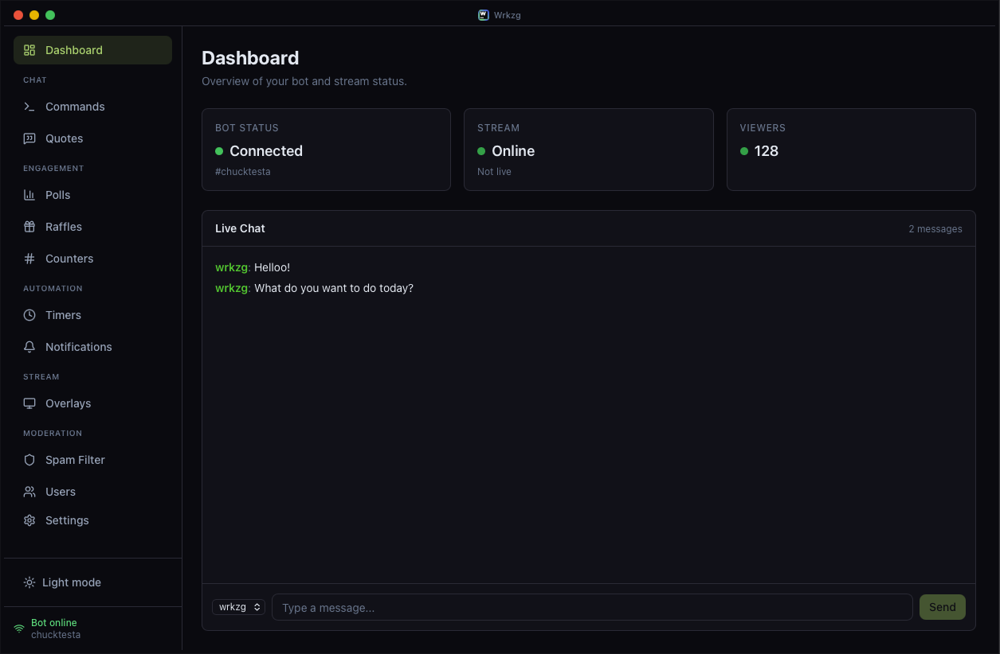

<div align="center">

# 🎮 Wrkzg

### The open-source, local-first Twitch bot with a modern dashboard.

**Your stream. Your data. Your machine.**

Wrkzg runs directly on your computer — no cloud services, no subscriptions, no data leaving your machine.
A full-featured Twitch bot with a built-in dashboard for chat commands, moderation, polls, raffles, points, and more.

[Download Latest Release](https://github.com/wrkzg-korvar/wrkzg-twitchbot/releases) · [Report Bug](https://github.com/wrkzg-korvar/wrkzg-twitchbot/issues) · [Request Feature](https://github.com/wrkzg-korvar/wrkzg-twitchbot/discussions)

---

[](https://github.com/wrkzg-korvar/wrkzg-twitchbot/actions)
[](LICENSE)
[](https://dotnet.microsoft.com)
[](#installation)
[](https://github.com/wrkzg-korvar/wrkzg-twitchbot/releases)
[](https://github.com/wrkzg-korvar/wrkzg-twitchbot/stargazers)

</div>

---

<div align="center">
    
    <br>
    <sub>Dashboard with live chat, bot status, and command management — shown in Dark & Light Mode</sub>
</div>

## Why Wrkzg?

Most Twitch bots either live in the cloud (your data on someone else's server) or are stuck on Windows only.
Wrkzg is different:

- **100% local** — Everything runs on your machine. No cloud, no external servers, no tracking.
- **Real desktop app** — Not a browser tab. A native window with a modern React dashboard built in.
- **Windows & macOS** — One of the only open-source Twitch bots that runs natively on both platforms.
- **Secure by default** — Your Twitch credentials are stored in your OS keychain (Windows DPAPI / macOS Keychain), never in config files.
- **Zero cost, forever** — Open source under MIT license. No subscriptions, no premium tiers, no ads.
- **Setup in minutes** — A built-in wizard walks you through everything. No config files, no terminal commands.

---

## How It Compares

> Choosing a Twitch bot? Here's how Wrkzg stacks up against the most popular alternatives.

| | **Wrkzg** | **Nightbot** | **Firebot** | **PhantomBot** | **Streamlabs Bot** |
|---|:---:|:---:|:---:|:---:|:---:|
| **Runs locally** | ✅ | ❌ Cloud | ✅ | ✅ | ❌ Cloud |
| **Desktop app** | ✅ Native | ❌ Browser | ✅ Electron | ❌ Web Panel | ❌ Browser |
| **Windows** | ✅ | ✅ Cloud | ✅ | ✅ | ✅ Cloud |
| **macOS** | ✅ | ✅ Cloud | ❌ | ✅ (via Java) | ❌ |
| **Modern dashboard** | ✅ React | ⚠️ Dated | ⚠️ Angular | ⚠️ Dated | ✅ |
| **Setup wizard** | ✅ | ✅ | ✅ | ❌ Manual | ✅ |
| **Secure credential storage** | ✅ OS Keychain | N/A | ❌ Config file | ❌ Config file | N/A |
| **Custom commands** | ✅ | ✅ | ✅ | ✅ | ✅ |
| **Points system** | ✅ | ❌ | ✅ | ✅ | ✅ |
| **Polls & raffles** | ✅ | ✅ Basic | ✅ | ✅ | ✅ |
| **Spam filter** | ✅ | ✅ | ✅ | ✅ | ✅ |
| **Timed messages** | ✅ | ✅ | ✅ | ✅ | ✅ |
| **Open source** | ✅ MIT | ❌ | ✅ GPL-3 | ✅ GPL-3 | ❌ |
| **No account required** | ✅ | ❌ | ✅ | ✅ | ❌ |
| **Price** | **Free** | Free (limited) | **Free** | **Free** | Freemium |

---

## Features

### ✅ Implemented

**Chat & Commands**
- **Custom Commands** — Create commands like `!discord`, `!socials` with variables: `{user}`, `{points}`, `{random:1:6}`
- **16 System Commands** — Built-in `!poll`, `!vote`, `!raffle`, `!join`, `!draw`, `!editcmd`, `!quote`, `!so`, `!uptime` and more — all with enable/disable toggle and custom response templates
- **Command Aliases** — Multiple triggers per command with badge display

**Community Engagement**
- **Points System** — Automatic rewards per minute while live, with subscriber multiplier
- **Polls & Votes** — `!poll` with live bar chart, countdown timer, and customizable templates
- **Raffles & Giveaways** — Keyword entry, animated draw, winner verification, multi-winner support
- **Counters** — Dashboard +/- buttons, chat commands (`!deaths`, `!deaths+`), custom templates

**Moderation**
- **Spam Filter** — Links, caps, banned words, emote spam, repetition detection — mods and subs exempt
- **Timed Messages** — Recurring messages with cycling, minimum chat line threshold, online/offline modes

**Quotes & Chat Tools**
- **Quotes System** — Save memorable chat moments with `!quote add`, retrieve with `!quote` or `!quote #`, dashboard management
- **Shoutout Command** — `!so @user` with live game/channel lookup via Twitch Helix API
- **Uptime Command** — `!uptime` / `!live` with smart time formatting

**OBS Overlays**
- **6 Browser Source Overlays** — Alert Box, Chat Box, Poll, Raffle, Counter, Event List — all real-time via SignalR
- **Auto-Reconnect** — Overlays detect when the bot restarts and reload automatically within 10 seconds
- **Customizable** — Font size, colors, animations, duration — configurable per overlay type from the dashboard
- **Copy URL** — One-click copy of the OBS Browser Source URL for each overlay

**Dashboard & UX**
- **Live Dashboard** — Real-time chat feed, bot status, viewer count, activity feed, command management
- **Live Chat** — Send messages as bot or broadcaster, auto-scroll, message history, Twitch emote rendering
- **User Tracking** — Message count, watch time, points, mod/sub/broadcaster status sync
- **Setup Wizard** — Guided first-time setup with direct links to Twitch Developer Console
- **Design System** — Light and Dark theme with consistent CSS custom properties
- **Cross-Platform** — Native desktop app on Windows 10/11 and macOS 12+ with platform-specific title bars
- **Update Check** — Automatic check for new releases with dismissable banner

### 🚧 Coming Soon

| Version | Features |
|---|---|
| **Future** | Chat games, song requests, auto-updater, Linux support |

---

## Architecture

Wrkzg runs as a **single desktop process** — no separate server, no Docker, no external dependencies.
It embeds a Kestrel HTTP server and a Photino browser window into one self-contained application.

```
┌─────────────────────────────────────────────┐
│           Photino Window                     │
│        (Chromium on Windows / WebKit on Mac) │
│                                              │
│   ┌─────────────────────────────────────┐    │
│   │  React 19 Dashboard (TypeScript)    │    │
│   │  Tailwind CSS v4 · Vite · SignalR   │    │
│   └──────────────┬──────────────────────┘    │
└──────────────────┼───────────────────────────┘
                   │ HTTP + WebSocket
┌──────────────────┼───────────────────────────┐
│  ASP.NET Core Kestrel Server                 │
│                                              │
│  ┌──────────┐  ┌────────────┐  ┌──────────┐ │
│  │   Core   │  │ Infra-     │  │ SignalR  │ │
│  │  (Logic, │  │ structure  │  │  Hubs    │ │
│  │ Commands,│  │ (EF Core,  │  │ (Real-   │ │
│  │  Events) │  │  Twitch    │  │  time)   │ │
│  │          │  │  API, IRC) │  │          │ │
│  └──────────┘  └─────┬──────┘  └──────────┘ │
│                      │                       │
│               ┌──────┴──────┐                │
│               │   SQLite    │                │
│               └─────────────┘                │
└──────────────────────────────────────────────┘
```

**Key design decisions:**
- **Clean Architecture** — Core logic has zero dependencies on infrastructure
- **OS Keychain** — Twitch secrets stored via Windows DPAPI / macOS Keychain (never in config files)
- **SignalR** — Real-time push from backend to dashboard (chat messages, poll updates, viewer count)
- **Single-file publish** — One executable, no runtime installation needed

For the full architecture breakdown, see [ARCHITECTURE.md](_docs/ARCHITECTURE.md).

---

## Tech Stack

| Layer | Technology |
|---|---|
| Language & Runtime | C# · .NET 10 |
| Desktop Host | [Photino.NET](https://tryphotino.io/) |
| Backend / API | ASP.NET Core · Kestrel · SignalR |
| Frontend | React 19 · TypeScript · Vite · Tailwind CSS v4 |
| Database | SQLite · Entity Framework Core 10 |
| Twitch Integration | TwitchLib · Twitch Helix API · EventSub WebSocket |

---

## Installation

Download the latest release for your platform from the **[Releases page](https://github.com/wrkzg-korvar/wrkzg-twitchbot/releases)**.

### Windows

1. Download and extract the `.zip` file
2. Run `Wrkzg.exe`
3. Windows SmartScreen may show a warning — click **"More info"** → **"Run anyway"**

> **Tip:** Right-click the ZIP before extracting → Properties → check **"Unblock"** → OK. This removes the warning for all files inside.

### macOS

1. Download and extract the `.zip` file
2. Double-click `Wrkzg.app` — macOS will block it. Click **"Done"**
3. Open **System Settings → Privacy & Security**
4. Scroll to the bottom — click **"Open Anyway"** next to the Wrkzg message
5. Enter your password — the app launches and is remembered for future starts

**Alternative (Terminal):**
```bash
xattr -cr ~/Downloads/Wrkzg.app
open ~/Downloads/Wrkzg.app
```

> **Note:** Wrkzg is not signed with an Apple Developer Certificate. Since macOS 15 (Sequoia), the right-click → Open workaround no longer works. The System Settings method above is required on macOS 15+ and macOS 26 (Tahoe).

### Prerequisites

| | Windows | macOS |
|---|---|---|
| OS Version | Windows 10 / 11 | macOS 12+ |
| Architecture | x64 | x64 · Apple Silicon (ARM64) |
| .NET Runtime | Bundled (self-contained) | Bundled (self-contained) |
| WebView | WebView2 (pre-installed with Edge) | WebKit (built-in) |

### First-Time Setup

When you start Wrkzg for the first time, a **Setup Wizard** guides you through everything:

1. **Create a Twitch App** — The wizard links you directly to the Twitch Developer Console and provides copy-paste values
2. **Enter Credentials** — Paste your Client ID and Client Secret (encrypted in your OS keychain)
3. **Connect Bot Account** — OAuth flow opens in your system browser
4. **Connect Broadcaster Account** — Same flow with your main streamer account
5. **Set Channel** — Enter your channel name — done

No manual config file editing. No terminal. No JSON.

---

## Building from Source

<details>
<summary>Click to expand build instructions</summary>

**Prerequisites:**
- [.NET 10 SDK](https://dotnet.microsoft.com/download/dotnet/10.0)
- [Node.js 22 LTS](https://nodejs.org/)
- Git

```bash
# 1. Clone the repository
git clone https://github.com/wrkzg-korvar/wrkzg-twitchbot.git
cd wrkzg-twitchbot

# 2. Install frontend dependencies and build
cd src/Wrkzg.Frontend
npm install
npm run build
cd ../..

# 3. Restore .NET dependencies
dotnet restore

# 4. Build
dotnet build

# 5. Run
dotnet run --project src/Wrkzg.Host
```

### Development Setup (Contributors)

Contributors can optionally use `appsettings.Development.json` as a **fallback** for local development. The app always checks the OS keychain first — this file is only used if no keychain credentials are found.

```json
{
  "Bot": {
    "Port": 5050
  }
}
```

> ⚠️ Never put secrets in config files. Use the Setup Wizard to store credentials in the OS keychain. The config file is only for non-sensitive settings like the port number. `appsettings.Development.json` is listed in `.gitignore`.

</details>

---

## Contributing

Contributions are welcome! Wrkzg is open source and built in the open.

Please read **[CONTRIBUTING.md](_docs/CONTRIBUTING.md)** before opening a pull request. It covers the development environment, project structure, architecture rules, coding conventions, and commit message format.

For questions or ideas, open a **[GitHub Discussion](https://github.com/wrkzg-korvar/wrkzg-twitchbot/discussions)**.

---

## Roadmap

<details>
<summary><strong>v1.0.0 — MVP ✅</strong></summary>

- Twitch OAuth (bot + broadcaster account)
- IRC connection + custom commands
- System commands (!commands, !points, !watchtime, !followage)
- User tracking (messages, watch time, points, mod/sub/broadcaster sync)
- Points system (automatic rewards, sub multiplier)
- Dashboard (live chat, commands CRUD, user table, settings)
- Setup Wizard
- Custom title bar with OS-native window controls
- Design system with Light/Dark theme

</details>

<details>
<summary><strong>v1.0.1 — Polish ✅</strong></summary>

- Windows blank screen fix (STA threading for WebView2)
- macOS .app bundle with ad-hoc code signing
- Release artifact cleanup
- Chromeless window resize border

</details>

<details>
<summary><strong>v1.1.0 — Community Features ✅</strong></summary>

- Polls & Votes (live bar chart, countdown, templates)
- Raffles & Giveaways (animated draw, multi-winner, templates)
- Timed Messages (message cycling, min chat lines, online/offline)
- Spam Filter (links, caps, banned words, emotes, repetition)
- Counters (dashboard +/-, chat commands, templates)
- Editable System Commands (enable/disable, custom responses)
- Live Chat improvements (send as bot/broadcaster, auto-scroll)

</details>

<details>
<summary><strong>v1.2.0 — Chat Tools ✅</strong></summary>

- Quotes System (`!quote add`, `!quote`, `!quote #`, `!quote delete #`, dashboard page)
- Shoutout Command (`!so @user` with Helix game/channel lookup)
- Uptime Command (`!uptime` / `!live`)
- Command Aliases (frontend editor, badge display in command table)

</details>

<details>
<summary><strong>v1.3.0 — Live Events ✅</strong></summary>

- EventSub WebSocket integration (TwitchLib.EventSub.Websockets)
- Follow / Subscribe / Gift Sub / Resub / Raid notifications with customizable templates
- Dashboard notification settings page with per-event toggles and test buttons
- Dashboard activity feed with real-time event display
- Auto-shoutout for raiders via Twitch Helix API

</details>

<details>
<summary><strong>v1.4.1 — OBS Overlays ✅</strong></summary>

- OBS Browser Source overlays (Alert Box, Chat, Poll, Raffle, Counter, Event List)
- Overlay settings dashboard with live preview and customizable properties
- SignalR dual groups (dashboard + overlay), overlay auto-reconnect with health polling
- Twitch emote rendering via CDN in live chat and chat overlay
- Frontend component library and full reorganization
- Port changed from 5000 to 5050 (avoids macOS AirPlay Receiver conflict)
- Multiple WKWebView compatibility fixes (Headers, empty response bodies)

</details>

### Future
- Chat Games (Heist, Duel, Slots, Trivia, Roulette)
- Automatic updater (GitHub Releases download + install)
- Song request queue
- Analytics & Charts
- Linux support

---

## License

Wrkzg is licensed under the [MIT License](LICENSE). © 2026 wrkzg.io

---

<div align="center">

**If Wrkzg is useful to you, consider giving it a ⭐ on GitHub — it helps others discover the project.**

</div>
